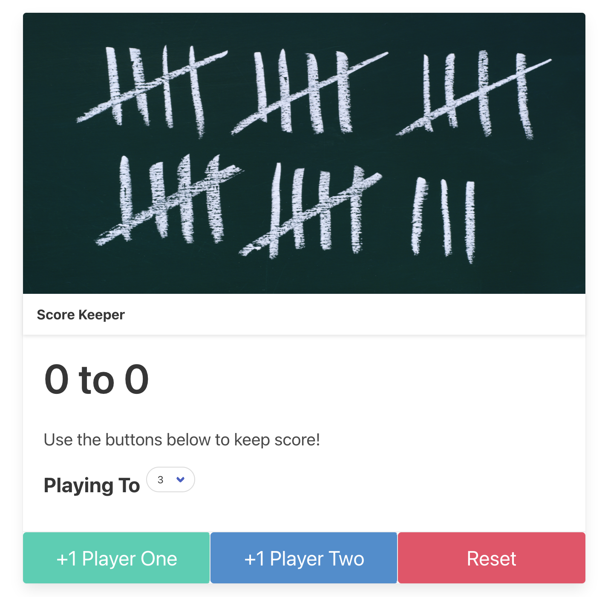

# ScoreKeeper
A simple Score Keeper app using HTML and JavaScript with Bulma as the CSS framework. 

[Click here](https://blksmk8483.github.io/ScoreKeeper/) to try it yourself!

## Description 
This was practice for me using more javascript and I also wanted to try the basics of a different CSS framework. I chose to try Bulma.

## Future Development
- I will add the option of having more than 2 players. 
- Possibly adding on to this so I can save my scores for future play.

## License

---

